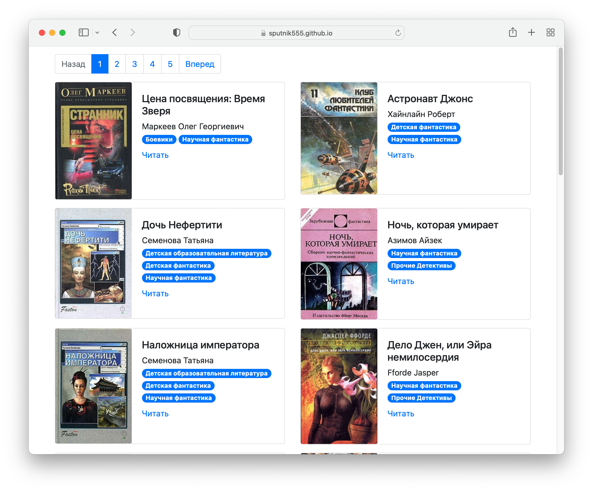

# Парсер книг с сайта [tululu.org](https://tululu.org)

Скрипт предназначен для скачивания файлов книг и их обложек из онлайн-библиотеки [tululu.org](https://tululu.org)

### Как установить

Python3 должен быть уже установлен. 
Затем используйте `pip` (или `pip3`, если есть конфликт с Python2) для установки зависимостей:
```
pip install -r requirements.txt
```

### Аргументы и пример запуска скрипта

Пример команды для запуска скрипта
```
parse_tululu_category.py --start_page 700 --json_path 1.json --dest_folder result --skip_imgs
```
Описание параметров:

```--start_id``` стартовый номер страницы

```--end_id``` конечный номер страницы

`--dest_folder` путь к каталогу с результатами парсинга: картинкам, книгам, JSON.

```--max_retries``` количество попыток переподключения в случае возникновения ошибки соединения. 
По-умолчанию скрипт совершит 10 попыток подключения.

`--skip_txt` не скачивать книги

`--skip_imgs` не скачивать картинки

### Генерация веб-сайта из скачанных книг



Из скачанных файлов возможно сгенерировать веб-сайт. Для этого предназначен скрипт ```render_website.py```.
Для запуска необходимо выполнить команду:

`python render_website.py`

В результате его выполнения в папке `pages` будут созданы HTML страницы с каталогом книг, по 20 штук на каждой.

С примером получившегося сайта можно ознакомится по [ссылке](https://sputnik555.github.io/parse_library/pages/index1.html) 

### Цель проекта

Код написан в образовательных целях на онлайн-курсе для веб-разработчиков [dvmn.org](https://dvmn.org/).